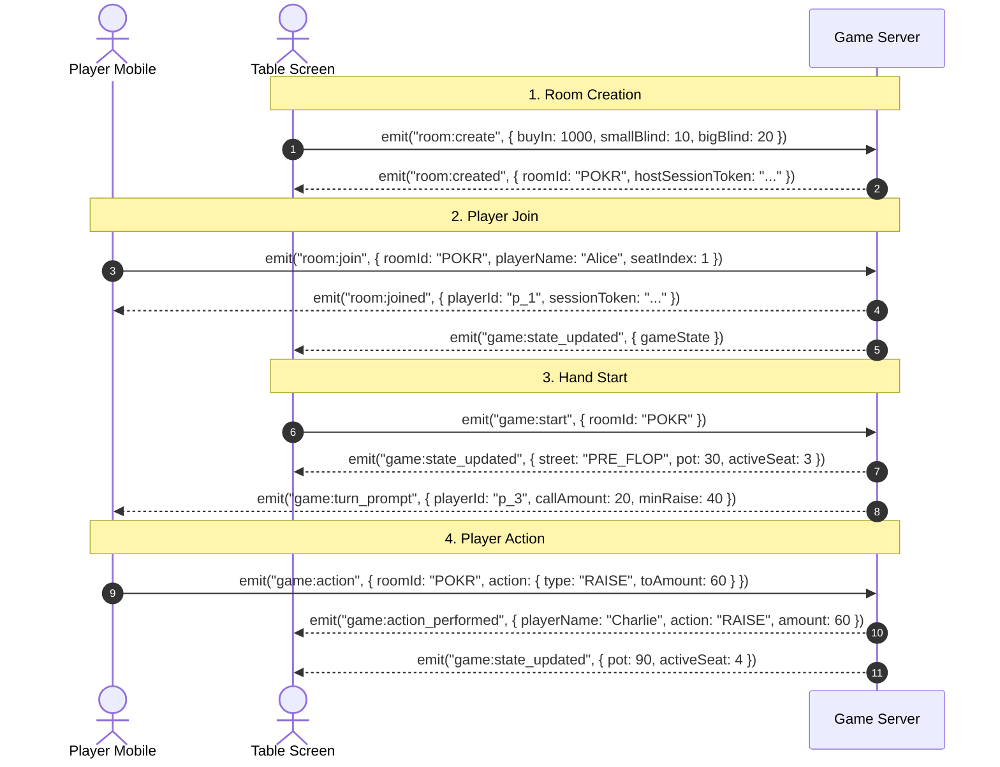

# API & Real-Time Event Contracts: Poker Credits

## 1. Overview

The communication between the **Next.js Client** (Table Display & Player Controllers) and the **Authoritative Game Server** uses a combination of:
1. **Socket.io Events**: High-frequency, bidirectional, low-latency state synchronization.
2. **REST Endpoints**: Ephemeral room discovery, LAN connection info, and health checks.

All payloads are strictly validated using **Zod** schemas.

---

## 2. Real-Time Socket.io Event Contracts



---

## 3. Client-to-Server (C2S) Events

### 3.1. `room:create`
Emitted by the central table display to initialize a new game room.
* **Payload**:
```typescript
export interface RoomCreatePayload {
  config: {
    startingChips: number;      // e.g. 1000
    smallBlind: number;         // e.g. 10
    bigBlind: number;           // e.g. 20
    isTournament: boolean;      // false = Cash Game, true = Tournament
    blindLevelMinutes?: number; // e.g. 15
    turnTimeLimitSeconds?: number; // e.g. 30
  };
}
```

### 3.2. `room:join`
Emitted by player controllers or spectators joining an existing room.
* **Payload**:
```typescript
export interface RoomJoinPayload {
  roomId: string;               // 4-letter alphanumeric code (e.g. "POKR")
  playerName: string;          // E.g. "Alice"
  seatIndex?: number;          // Preferred seat 0-9 (optional)
  sessionToken?: string;       // Reconnection token if refreshing
}
```

### 3.3. `game:start`
Emitted by the host/table to start the first hand or advance to the next hand.
* **Payload**:
```typescript
export interface GameStartPayload {
  roomId: string;
}
```

### 3.4. `game:action`
Emitted by the active player to execute a betting action.
* **Payload**:
```typescript
export interface GameActionPayload {
  roomId: string;
  action:
    | { type: 'FOLD' }
    | { type: 'CHECK' }
    | { type: 'CALL' }
    | { type: 'RAISE'; toAmount: number }
    | { type: 'ALL_IN' };
}
```

### 3.5. `game:showdown:resolve`
Emitted by the host/table screen at showdown to award main and side pots to the winning players.
* **Payload**:
```typescript
export interface ShowdownResolvePayload {
  roomId: string;
  allocations: {
    potIndex: number;          // 0 = Main Pot, 1 = Side Pot 1, etc.
    winnerPlayerIds: string[]; // Supports split pots (e.g. ["p_1", "p_2"])
  }[];
}
```

### 3.6. `game:admin:undo`
Emitted by the host to undo an accidental player action (e.g. accidental fold or miskeyed bet).
* **Payload**:
```typescript
export interface GameUndoPayload {
  roomId: string;
}
```

### 3.7. `game:rebuy`
Emitted when a busted player requests a stack reload, or when the host approves an add-on.
* **Payload**:
```typescript
export interface GameRebuyPayload {
  roomId: string;
  playerId: string;
  amount: number;
}
```

---

## 4. Server-to-Client (S2C) Events

### 4.1. `room:joined`
Sent exclusively to the client that just joined, providing their session credentials.
```typescript
export interface RoomJoinedResponse {
  success: boolean;
  playerId: string;
  sessionToken: string;
  isHost: boolean;
}
```

### 4.2. `game:state_updated`
Broadcast to all room sockets whenever the table state advances.
```typescript
export interface GameStateBroadcast {
  roomId: string;
  street: 'LOBBY' | 'PRE_FLOP' | 'FLOP' | 'TURN' | 'RIVER' | 'SHOWDOWN' | 'HAND_ENDED';
  dealerSeat: number;
  smallBlindSeat: number;
  bigBlindSeat: number;
  activeSeat: number | null;
  currentHighBet: number;
  minRaise: number;
  totalPot: number;
  pots: {
    tierIndex: number;
    amount: number;
    eligiblePlayerIds: string[];
  }[];
  seats: {
    seatIndex: number;
    playerId: string | null;
    name: string | null;
    chips: number;
    currentStreetBet: number;
    hasFolded: boolean;
    isAllIn: boolean;
    isSittingOut: boolean;
    isConnected: boolean;
  }[];
  handNumber: number;
}
```

### 4.3. `game:turn_prompt`
Sent directly to the player whose turn it currently is (triggers the mobile vibration API).
```typescript
export interface TurnPromptEvent {
  playerId: string;
  seatIndex: number;
  timeRemainingSeconds: number;
  legalActions: {
    canFold: boolean;
    canCheck: boolean;
    canCall: boolean;
    callAmount: number;
    canRaise: boolean;
    minRaiseTo: number;
    maxRaiseTo: number; // Player stack
  };
}
```

### 4.4. `game:action_performed`
Broadcast for UI animations, audio clinks, and the real-time action ticker.
```typescript
export interface ActionPerformedEvent {
  playerId: string;
  playerName: string;
  action: 'FOLD' | 'CHECK' | 'CALL' | 'RAISE' | 'ALL_IN';
  amount?: number;
  chipsRemaining: number;
}
```

### 4.5. `game:error`
Sent when an invalid action is attempted.
```typescript
export interface GameErrorEvent {
  code: string;
  message: string;
}
```

---

## 5. Standard Error Codes

| Code | Description | UI Handling |
| :--- | :--- | :--- |
| `NOT_YOUR_TURN` | Player attempted an action out of turn. | Disables buttons; displays alert banner. |
| `INVALID_CHECK` | Cannot check; there is an outstanding bet to call. | Replaces "Check" button with "Call $X". |
| `BELOW_MIN_RAISE` | Raise is lower than previous raise sizing. | Snaps raise slider to the valid minimum. |
| `INSUFFICIENT_FUNDS` | Bet exceeds available player stack. | Caps bet at All-In. |
| `ROOM_NOT_FOUND` | Room code does not exist. | Returns user to landing screen with error toast. |
| `SEAT_OCCUPIED` | Chosen seat is already taken. | Highlights next available seat. |
| `ROOM_FULL` | Room has reached maximum player capacity (10). | Shows "Room Full" toast, offers spectator mode. |
| `INVALID_SESSION` | Session token is missing, expired, or tampered. | Forces full re-join flow. |
| `ACTION_ALREADY_PROCESSED` | Duplicate `actionSequenceId` received. | Silently discarded; no UI change needed. |
| `HOST_ONLY_ACTION` | Non-host client attempted a host-only action. | Shows "Host Only" toast, hides admin controls. |
| `HAND_NOT_IN_PROGRESS` | Action sent when no active hand is running. | Refreshes client state from snapshot. |
| `GAME_PAUSED` | Player action sent while game is paused. | Shows "Game Paused" overlay; locks all buttons. |

---

## 6. Missing Events Added

> [!IMPORTANT]
> The following events were **missing from the original specification** and are now added:

### 6.1. C2S: `game:admin:pause` / `game:admin:resume`
Host-only events to pause/resume the game mid-hand.
```typescript
export interface GamePausePayload {
  roomId: string;
  // No extra fields; server validates host token from socket auth
}
// Same interface reused for resume
```

### 6.2. C2S: `room:reconnect`
Sent by a client whose socket disconnected and is reconnecting.
```typescript
export interface RoomReconnectPayload {
  roomId: string;
  sessionId: string; // Private token issued at room:join
}
```

### 6.3. S2C: `game:state_snapshot`
Full authoritative state sent exclusively to a reconnected client to reconcile their UI.
```typescript
export interface GameStateSnapshot {
  fullState: GameStateBroadcast; // Complete state, not a delta
  reconnectedAt: string;         // ISO timestamp
}
```

### 6.4. S2C: `game:timer_tick`
Broadcast every second during the turn countdown timer so all devices show the same countdown.
```typescript
export interface GameTimerTickEvent {
  activeSeat: number;
  timeRemainingSeconds: number;
}
```

### 6.5. S2C: `player:connection_status`
Broadcast to all room members whenever any player disconnects or reconnects.
```typescript
export interface PlayerConnectionStatusEvent {
  seatIndex: number;
  playerId: string;
  isConnected: boolean;
}
```

### 6.6. S2C: `game:paused` / `game:resumed`
Broadcast to all connected clients when the host pauses or resumes the game.
```typescript
export interface GamePausedEvent {
  pausedBy: string;     // Host playerId
  reason?: string;      // Optional note displayed on all screens
}
export interface GameResumedEvent {
  resumedBy: string;
  turnTimeRemainingSeconds: number; // Remaining seconds restored on active player's turn
}
```

---

## 7. HTTP / REST Endpoints

### `GET /health`
* **Response**: `200 OK`
```json
{
  "status": "healthy",
  "activeRooms": 3,
  "timestamp": "2026-10-07T10:14:00Z"
}
```

### `GET /api/lan/info`
Used by the LAN host screen to discover local network interfaces and construct local QR codes.
* **Response**: `200 OK`
```json
{
  "isLanMode": true,
  "localIp": "192.168.1.45",
  "port": 3000,
  "url": "http://192.168.1.45:3000"
}
```

### `GET /api/room/:roomId/exists`
Used by the join screen to verify a room code is valid before attempting a socket connection.
```json
{ "exists": true, "playerCount": 3, "maxPlayers": 10, "isFull": false }
```

---

## 8. Payload Versioning

> [!IMPORTANT]
> All socket payloads and REST responses **must** include a `v` field for future compatibility. This allows rolling upgrades where server and clients may briefly be on different versions.

```typescript
// Every C2S payload includes:
{ v: 1, ...rest }

// Every S2C broadcast includes:
{ v: 1, ...rest }
```

If a client sends `v: 0` to a `v: 1` server, the server responds with `game:error` code `VERSION_MISMATCH` and the client triggers a page refresh to load the latest bundle.
