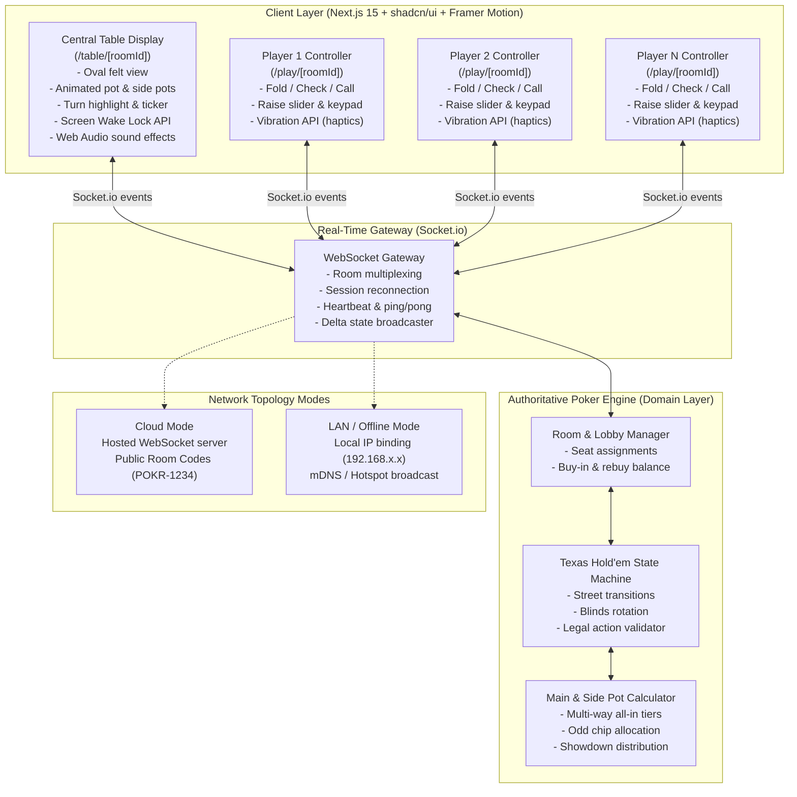
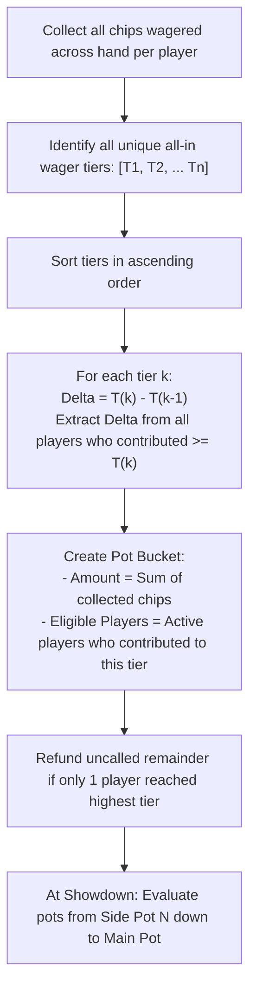
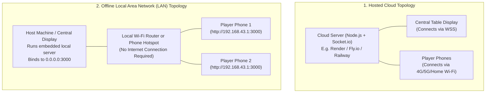

# Architecture & System Design: Poker Credits

## 1. Executive Summary

**Poker Credits** is a real-time, multi-device companion application designed for in-person Texas Hold'em poker games. It completely replaces physical poker chips with a digital credit, pot, and betting system while players handle physical cards in real life.

The system is architected around two distinct screen paradigms:
1. **Central Table / Pot Display**: A single tablet, laptop, or TV placed at the center of the table showing the active pot, side pots, radial seating, dealer button, turn countdown, and action ticker.
2. **Player Controller**: Individual smartphones held by each player acting as a one-handed tactile controller for checking, calling, raising, and folding.

The backend is an **Authoritative Game Server** operating either in the cloud or over a Local Area Network (LAN) without internet access.

---

## 2. High-Level System Architecture

---

## 3. Core Subsystems & Components

### 3.1. Authoritative Poker Engine (`@poker-credits/shared`)
The poker engine is implemented as a **pure TypeScript domain module** with zero runtime dependencies. It guarantees that:
* No client can execute an illegal action (e.g. betting less than min-raise or checking when facing a bet).
* All game state transitions are deterministic and pure: `(currentState, action) => nextState`.
* Can be run on the server authoritatively and simultaneously on the client for optimistic UI validation.

### 3.2. Real-Time Communication Hub (`server/`)
* **Transport**: WebSocket via `Socket.io` with HTTP polling fallback.
* **Room Isolation**: Each game session exists inside an isolated Socket.io room (`room:${roomId}`).
* **Session Persistence**: Players receive an ephemeral signed session token in `localStorage`. If a mobile browser refreshes or the phone screen turns off, re-connecting automatically re-associates the socket with their seat without disrupting the game.

### 3.3. Responsive UI Layer (`client/`)
Built with **Next.js 15 (App Router)**, **Tailwind CSS**, **shadcn/ui**, and **Framer Motion**:
* **Table View**: Utilizes CSS trigonometric functions and radial positioning to render player seats in an authentic poker oval matching real-life table seating.
* **Player View**: Optimized for thumb-reach ergonomics with high-contrast active buttons, custom raise slider, and haptic feedback.

---

## 4. Texas Hold'em State Machine

> **Note**: `PAUSED` is a host-only state accessible from any active betting street. When the host pauses the game (e.g. to resolve a dispute or take a break), no player actions are accepted. The host resumes by unpausing, restoring the exact state and turn clock as it was before.

```mermaid
stateDiagram-v2
    [*] --> LOBBY: Players join & configure buy-ins
    LOBBY --> STARTING_HAND: Host clicks "Deal Hand"

    STARTING_HAND --> POSTING_BLINDS: Advance Dealer (D) button
    POSTING_BLINDS --> PRE_FLOP: Deduct SB & BB, prompt UTG

    PRE_FLOP --> FLOP: All bets matched
    FLOP --> TURN: All bets matched
    TURN --> RIVER: All bets matched
    RIVER --> SHOWDOWN: All bets matched

    PRE_FLOP --> ALL_IN_RUNOUT: All remaining players are All-In
    FLOP --> ALL_IN_RUNOUT: All remaining players are All-In
    TURN --> ALL_IN_RUNOUT: All remaining players are All-In
    ALL_IN_RUNOUT --> SHOWDOWN: Board cards dealt IRL; no more betting

    PRE_FLOP --> HAND_WON_UNCONTESTED: All players fold except one
    FLOP --> HAND_WON_UNCONTESTED: All players fold except one
    TURN --> HAND_WON_UNCONTESTED: All players fold except one
    RIVER --> HAND_WON_UNCONTESTED: All players fold except one

    PRE_FLOP --> PAUSED: Host pauses game
    FLOP --> PAUSED: Host pauses game
    TURN --> PAUSED: Host pauses game
    RIVER --> PAUSED: Host pauses game
    PAUSED --> PRE_FLOP: Host resumes (was PRE_FLOP)
    PAUSED --> FLOP: Host resumes (was FLOP)
    PAUSED --> TURN: Host resumes (was TURN)
    PAUSED --> RIVER: Host resumes (was RIVER)

    SHOWDOWN --> PAYOUT: Host/Players mark winners for Main & Side Pots
    HAND_WON_UNCONTESTED --> PAYOUT: Pot awarded automatically to survivor

    PAYOUT --> NEXT_HAND_PREP: Chip stacks updated, bustouts flagged
    NEXT_HAND_PREP --> STARTING_HAND: Ready for next hand
    NEXT_HAND_PREP --> LOBBY: All but one player busted (game over)
```

### 4.1. Street Transition Invariants
A betting round (street) concludes if and only if:
1. Every active (non-folded, non-all-in) player has contributed an equal amount of chips to the current street.
2. Every active player has had at least one opportunity to act.
3. Or all active players except one have folded → `HAND_WON_UNCONTESTED`.
4. Or all remaining non-folded players are all-in → `ALL_IN_RUNOUT` (fast-forward to Showdown, board cards still dealt IRL).

### 4.2. Client Role Types
Three distinct client roles connect to the same room:

| Role | Route | Capabilities |
| :--- | :--- | :--- |
| `TABLE_HOST` | `/table/[roomId]` | Full admin: start hand, undo, pause, approve rebuys, resolve showdown |
| `PLAYER` | `/play/[roomId]` | Act on turn (fold/check/call/raise), request rebuy |
| `SPECTATOR` | `/watch/[roomId]` | Read-only table view, no actions, no seat |

> **Missing from original docs** — Spectator mode was not defined but is needed for onlookers who want to watch without playing, and for busted-out players who wish to stay engaged.

---

## 5. Main Pot & Side Pot Algorithm

Multi-way all-ins with unequal stacks are notoriously difficult to calculate manually at home games. The engine automates this using **Contribution-Tier Partitioning**:

### Mathematical Example:
* **Player A** is All-In for **$50**
* **Player B** is All-In for **$120**
* **Player C** Calls **$120**
* **Player D** Folds after contributing **$20**

**Tiers**: $20 (folded), $50 (All-in A), $120 (All-in B, Call C).
1. **Tier 1 (Main Pot)**: Up to $50 per player.
   * Player A ($50) + Player B ($50) + Player C ($50) + Player D ($20) = **$170**.
   * Eligible to win: **A, B, C**.
2. **Tier 2 (Side Pot 1)**: From $50 to $120 ($70 delta).
   * Player B ($70) + Player C ($70) = **$140**.
   * Eligible to win: **B, C**.

At showdown:
* Side Pot 1 ($140) is awarded to the best hand between **B and C**.
* Main Pot ($170) is awarded to the best hand among **A, B, and C**.

---

## 6. Dual-Mode Network Topology

### LAN Discovery & Hotspot Workflow
1. The host clicks "Start Local Game" on their laptop or mobile hotspot.
2. The server queries local network interfaces (`os.networkInterfaces()`) and binds to the primary IPv4 address.
3. The table screen renders a dynamic QR code containing the exact URL: `http://192.168.x.x:3000?room=POKR`.
4. Players scan the QR code to join immediately without internet or DNS.

---

## 7. Device Hardware API Integrations

| Web API | Screen Role | Purpose | Fallback / Degradation |
| :--- | :--- | :--- | :--- |
| **Screen Wake Lock API** | Central Table | Prevents the tablet/laptop display from dimming or sleeping during long hands. | Re-requests lock on tab focus; graceful no-op if unsupported. |
| **Vibration API** | Player Mobile | Emits a distinct dual-pulse haptic buzz (`[120, 80, 120]`) when it is the player's turn to act. | Audio cue + visual pulsing banner. |
| **Web Audio API** | Table & Player | Generates low-latency sound effects (chip clinking, check knock, all-in alert, showdown chime). | Audio disabled via mute toggle in header. |
