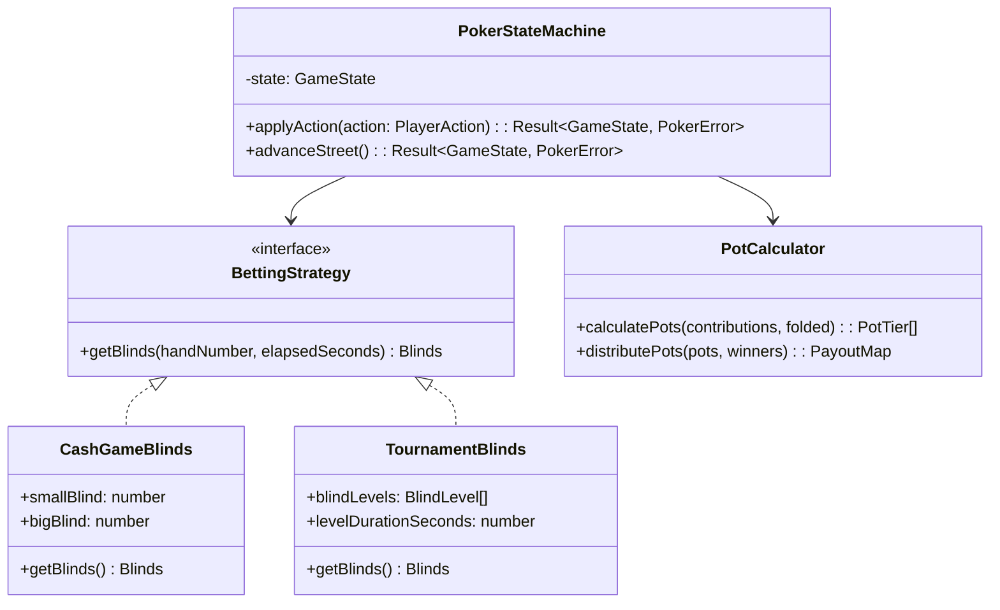
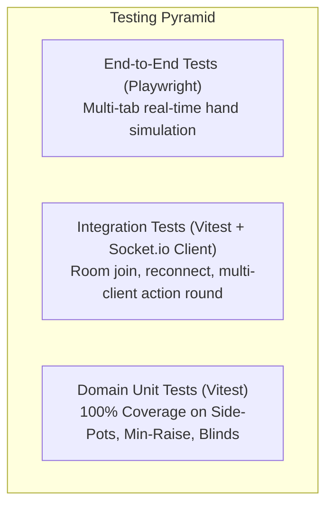

# Coding Standards, Design Patterns & Quality Guidelines

## 1. Core Engineering Principles

To maintain high maintainability, testability, and enterprise-grade reliability, the codebase adheres to the following foundational engineering principles:

### 1.1. SOLID Principles
* **Single Responsibility Principle (SRP)**: Each class, module, and hook has exactly one reason to change. The `PotCalculator` only computes chips; it does not evaluate hand ranks or manage sockets.
* **Open/Closed Principle (OCP)**: Game variations (e.g. Tournament blind levels vs Fixed cash blinds) are extensible via strategy interfaces without modifying the core state machine.
* **Liskov Substitution Principle (LSP)**: Betting rules adhere to standard contracts; mock adapters in tests cleanly substitute real transport layers.
* **Interface Segregation Principle (ISP)**: Clients only depend on the interfaces they consume. Table display screens do not receive private player controller action dispatchers.
* **Dependency Inversion Principle (DIP)**: Core poker domain logic depends on pure abstractions, never on concrete transport libraries (e.g., Socket.io) or UI frameworks.

### 1.2. KISS, DRY, and YAGNI
* **KISS (Keep It Simple, Stupid)**: Favor readable, declarative code over clever, convoluted abstractions.
* **DRY (Don't Repeat Yourself)**: Game validation, blind structures, and type contracts are authored once in `@poker-credits/shared` and reused verbatim on client and server.
* **YAGNI (You Aren't Gonna Need It)**: Do not prematurely abstract complex database ORMs or third-party auth services when local memory rooms and signed tokens completely fulfill the mission.

---

## 2. Architectural Design Patterns



### 2.1. State Pattern & Pure Reducers
The Texas Hold'em progression (`PRE_FLOP` &rarr; `FLOP` &rarr; `TURN` &rarr; `RIVER` &rarr; `SHOWDOWN`) is modeled as a deterministic state machine:
* **Pure Transitions**: State mutations follow the reducer pattern `(previousState, action) => nextState`.
* **Zero Mutation**: State objects are immutable. Every transition returns a cloned, validated new state representation.

### 2.2. Strategy Pattern
* **Blinds Strategy**: Easily switch between `CashGameStrategy` (fixed blinds, e.g. $5/$10) and `TournamentStrategy` (timed blind levels doubling every 15 minutes).

### 2.3. Observer / Event-Driven Architecture
* **Socket Events**: Client and server interact through strongly typed pub/sub events.
* **Optimistic UI with Reconciliation**: Player controllers show optimistic bet updates, confirmed or rolled back upon authoritative server broadcast.

---

## 3. TypeScript Standards & Type Safety

### 3.1. Strictness Configuration
The `tsconfig.json` enforces maximum type safety across all packages:
```json
{
  "compilerOptions": {
    "strict": true,
    "noImplicitAny": true,
    "strictNullChecks": true,
    "strictFunctionTypes": true,
    "noImplicitReturns": true,
    "noFallthroughCasesInSwitch": true,
    "exactOptionalPropertyTypes": true
  }
}
```

### 3.2. Branded Types for Domain Safety
To prevent passing a generic integer into a currency calculation or swapping player IDs with room IDs, use **branded types**:
```typescript
export type Brand<K, T> = K & { readonly __brand: T };

export type ChipAmount = Brand<number, 'ChipAmount'>;
export type PlayerId = Brand<string, 'PlayerId'>;
export type RoomId = Brand<string, 'RoomId'>;

export const toChips = (amount: number): ChipAmount => {
  if (amount < 0 || !Number.isInteger(amount)) {
    throw new Error(`Invalid chip amount: ${amount}`);
  }
  return amount as ChipAmount;
};
```

### 3.3. Discriminated Unions for Actions
All gameplay actions are strictly typed via discriminated unions:
```typescript
export type PlayerAction =
  | { type: 'FOLD'; playerId: PlayerId }
  | { type: 'CHECK'; playerId: PlayerId }
  | { type: 'CALL'; playerId: PlayerId; amount: ChipAmount }
  | { type: 'RAISE'; playerId: PlayerId; toAmount: ChipAmount }
  | { type: 'ALL_IN'; playerId: PlayerId; amount: ChipAmount };
```

### 3.4. Result Pattern for Domain Operations
Never throw untyped exceptions for anticipated domain errors (e.g., illegal raise size). Use a functional `Result` type:
```typescript
export type Result<T, E = PokerError> =
  | { success: true; data: T }
  | { success: false; error: E };

export const ok = <T>(data: T): Result<T, never> => ({ success: true, data });
export const err = <E>(error: E): Result<never, E> => ({ success: false, error });
```

---

## 4. Frontend & React / Next.js Guidelines

### 4.1. Component Separation & Structure
* **Separation of Concerns**:
  * **Presentational Components**: Pure, stateless UI components (e.g. `ChipStackView`, `PotCounter`, `RadialSeat`).
  * **Container / Screen Components**: Connect hooks and manage view state (e.g. `TableScreen`, `PlayerControllerScreen`).
  * **Custom Hooks**: Encapsulate side effects and real-time connectivity (`usePokerSocket`, `useHaptics`, `useWakeLock`).

### 4.2. shadcn/ui & Tailwind CSS Conventions
* Always utilize [shadcn/ui](https://ui.shadcn.com) primitives (`@/components/ui/*`) for interactive controls:
  * `Slider` for the Raise bet adjuster.
  * `Dialog` and `Drawer` for modals and bottom-sheet controls.
  * `Badge` for Dealer/Blind indicators.
* Use Tailwind CSS with explicit design tokens (e.g. `table-felt-green: #0a4f2e`, `chip-gold: #eab308`).
* Strictly adhere to accessibility guidelines (ARIA labels on action buttons, keyboard navigation on bet input, high-contrast text for dark room poker nights).

### 4.3. Animation Guidelines (Framer Motion)
* Animations must never block gameplay or introduce input latency.
* Use lightweight layout animations (`layoutId`, `AnimatePresence`) for:
  * Chips moving from player bets into the central pot.
  * Pot distribution to winner seats at showdown.
  * Turn indicator glow pulsing around the active player.

---

## 5. API & Validation Standards

### 5.1. Boundary Validation with Zod
Never trust incoming network data. All Socket.io payloads and HTTP parameters must be validated at the system boundary using **Zod**:
```typescript
import { z } from 'zod';

export const PlayerActionSchema = z.discriminatedUnion('type', [
  z.object({
    type: z.literal('FOLD'),
    playerId: z.string().min(1),
  }),
  z.object({
    type: z.literal('CHECK'),
    playerId: z.string().min(1),
  }),
  z.object({
    type: z.literal('CALL'),
    playerId: z.string().min(1),
    amount: z.number().int().positive(),
  }),
  z.object({
    type: z.literal('RAISE'),
    playerId: z.string().min(1),
    toAmount: z.number().int().positive(),
  }),
  // ✅ ALL_IN was missing from the original schema — now added
  z.object({
    type: z.literal('ALL_IN'),
    playerId: z.string().min(1),
  }),
]).and(
  // Action idempotency: every player action must include a monotonically
  // increasing sequence ID per hand to detect and discard duplicate submissions
  z.object({ actionSequenceId: z.number().int().nonnegative() })
);
```

---

## 6. Testing Strategy & Quality Assurance



### 6.1. Unit Testing Priorities (100% Target)
* **Side Pot Calculation Engine**:
  * Heads-up all-in with unequal stacks.
  * 3-way, 4-way all-ins with multiple stack tiers.
  * Split pot with odd-chip distribution (e.g. $101 split between 2 players &rarr; $51 to player closest to dealer button, $50 to second player).
* **Betting Constraints**:
  * Minimum raise sizing enforcement (raise must be at least the size of the previous bet/raise).
  * Checking when facing a bet must return an explicit `CANNOT_CHECK` error.
  * Blind rotation logic across hands and when players leave/bust out.

### 6.2. CI/CD & Linting Automation
* **Linter**: ESLint with `@typescript-eslint/recommended-type-checked`.
* **Formatter**: Prettier configured with 2 spaces, single quotes, trailing commas.
* **Pre-commit Hooks**: Husky + lint-staged executing typecheck, lint, and unit tests prior to commit.
