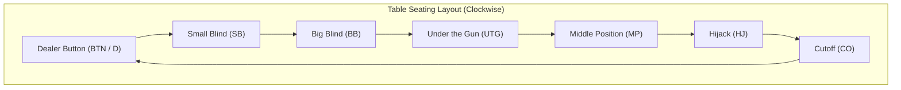
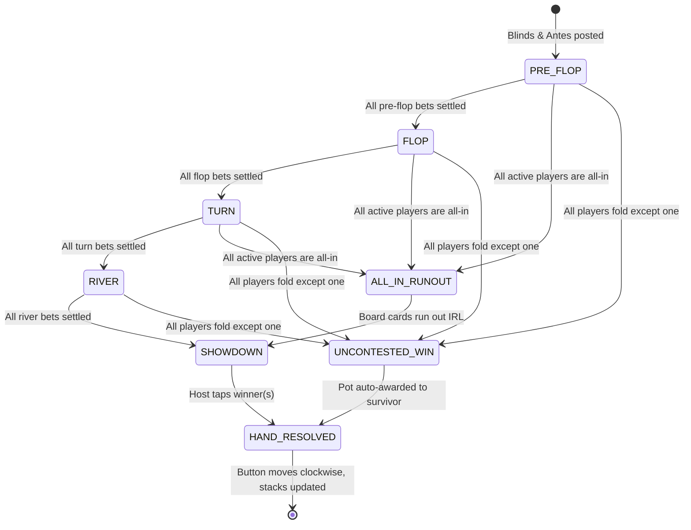
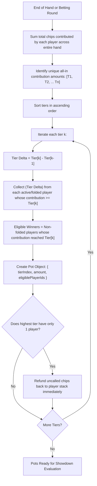

# Texas Hold'em Game Logic & Betting Rules Specification

## 1. Introduction & Hybrid Operational Model

**Poker Credits** serves as an authoritative digital companion for in-person Texas Hold'em games:
* **Cards (Physical)**: Players shuffle, cut, deal, and reveal physical cards on the table.
* **Credits / Chips (Digital)**: The application manages all financial and betting rules: blinds, turn order, minimum raise validation, all-in side pot calculations, and split pot payouts.

This document details the exact rules, state transitions, constraints, and edge-case behaviors implemented in `@poker-credits/shared`.

---

## 2. Table Seating & Positions

The table accommodates **2 to 10 players**. Seating positions determine both the turn order and forced bets:



### 2.1. Standard Full-Ring / Shorthanded (3–10 Players)
1. **Dealer Button (D / BTN)**: Rotates clockwise by 1 seat after every completed hand.
2. **Small Blind (SB)**: First active seat immediately to the left of the button.
3. **Big Blind (BB)**: Second active seat immediately to the left of the button.
4. **Pre-Flop Action Order**: Starts with **Under the Gun (UTG)** (left of Big Blind) and proceeds clockwise; Small Blind acts second-to-last, Big Blind acts last.
5. **Post-Flop Action Order (Flop, Turn, River)**: Starts with the **Small Blind** (or first active player left of the button) and proceeds clockwise; the Button acts last.

### 2.2. Heads-Up Exception Rules (Strict 2-Player Play)
When only 2 players are seated at the table, standard Texas Hold'em reverses the blind order:
* **The Dealer Button (BTN)** posts the **Small Blind** and acts **FIRST** pre-flop, but acts **LAST** post-flop.
* **The Non-Dealer** posts the **Big Blind** and acts **LAST** pre-flop, but acts **FIRST** post-flop.

```
Heads-Up Summary Table:
+----------------+--------------+------------------+-------------------+
| Player         | Blind Posted | Pre-Flop Order   | Post-Flop Order   |
+----------------+--------------+------------------+-------------------+
| Dealer (BTN)   | Small Blind  | Acts 1st (first) | Acts 2nd (last)   |
| Big Blind (BB) | Big Blind    | Acts 2nd (last)  | Acts 1st (first)  |
+----------------+--------------+------------------+-------------------+
```

---

## 3. Forced Bets: Blinds & Modes

Before physical cards are dealt, the app automatically deducts forced bets:

### 3.1. Cash Game Mode (Fixed Blinds)
* Fixed Small Blind and Big Blind values (e.g. $10 / $20).
* Values remain constant throughout the game unless manually modified by the table host.

### 3.2. Tournament Mode (Escalating Blind Levels)
* Features a synchronized **Tournament Clock**.
* Blinds increase according to a pre-defined schedule (e.g., Level 1: $10/$20, Level 2: $15/$30, Level 3: $25/$50 every 15 minutes).
* Supports optional **Antes** (collected from all players or via Big Blind Ante) starting at designated blind tiers.

---

## 4. Street Progression & Hand Lifecycle



### 4.1. Street Completion Invariant
A betting street is complete and advances to the next stage if and only if **both** of the following conditions are met:
1. **Equal Contribution**: Every active (non-folded, non-all-in) player has contributed an identical amount to the current street's pot.
2. **Every Player Has Acted**: Every active player has had at least one opportunity to act in this street (e.g. the Big Blind pre-flop must have the option to check or raise even if all players called).

### 4.2. All-In Fast-Forward (ALL_IN_RUNOUT)
If all active non-folded players are all-in (no one has chips left to wager), **no further betting can occur**.
* The app transitions to `ALL_IN_RUNOUT` state.
* A notification prompts the physical dealer to deal the remaining board cards (Flop, Turn, River) as required.
* Each remaining street is skipped without a betting round and the hand advances straight to **Showdown**.

### 4.3. Sit-Out Rule
A player may choose to **Sit Out** between hands (e.g., they stepped away). While sitting out:
* They are skipped in all blind rotations and turn orders.
* If they are due to post the Big Blind, a **missed blind** is recorded. When they return, they must post the missed big blind before being dealt in, or they wait until they are back in the BB position naturally.
* A player may not sit out during an active hand; they must wait until the next hand begins.

---

## 5. Player Actions & Betting Constraints

### 5.1. Fold
* The player forfeits their cards and any claim to the current pot.
* Removed from the turn rotation for the remainder of the hand.
* If only 1 player remains in the hand, the hand terminates immediately without showdown.

### 5.2. Check
* Passing action to the next player without adding chips.
* **Legality Rule**: A player may **ONLY** check if the current high bet on this street is $0, or if the player has already matched the high bet (e.g., the Big Blind pre-flop facing limpers).
* If a prior player has bet or raised, `CHECK` is illegal and the UI automatically switches the action to `CALL`.

### 5.3. Call
* Matching the current high bet on the street:
  $$\text{Call Amount} = \text{Current High Bet} - \text{Player's Current Street Contribution}$$
* **All-In Call**: If the player's total remaining stack is less than the call amount, the player is considered **All-In** for their full stack, creating a side pot.

### 5.4. Bet & Raise Constraints (No-Limit Hold'em Rules)
* **Minimum Opening Bet**: Must be at least equal to the current **Big Blind**.
* **Minimum Raise Size**:
  In No-Limit Hold'em, a raise must be at least equal to the size of the previous bet or raise in that betting round:
  $$\text{Min Raise To} = \text{Current High Bet} + \max(\text{Big Blind}, \text{Previous Raise Delta})$$
  
  *Example*:
  1. Big Blind is **$20**.
  2. Player 1 raises to **$60**. The raise delta is $\$60 - \$20 = \$40$.
  3. Player 2 wants to re-raise. The minimum re-raise must be at least $\$60 + \$40 = \mathbf{\$100}$.

* **Maximum Raise**: Any amount up to the player's entire remaining stack (All-In).

### 5.5. The Incomplete / Short All-In Rule
If a player goes All-In for an amount that is less than the full minimum raise:
* It is a legal action for the all-in player.
* **Bet Reopening Rule**: It does **NOT** reopen the betting action for any player who has already acted, unless a subsequent player makes a full, legal raise.

---

## 6. Main Pot & Side Pot Algorithm

The app automatically calculates multiple side pots when players with unequal chip counts go all-in.



### Concrete Multi-Way All-In Scenario

Consider 4 players with the following starting stacks:
* **Alice**: $100
* **Bob**: $250
* **Charlie**: $600
* **Dave**: $600

**Hand Progression**:
1. Alice goes All-In for **$100**.
2. Bob goes All-In for **$250**.
3. Charlie Raises to **$500**.
4. Dave Folds after having contributed **$40** in prior betting.
5. All betting closes. Total chips on table = $\$100 + \$250 + \$500 + \$40 = \$890$.

**Tier Calculation**:
* **Step 1: Uncalled Bet Refund**:
  Charlie bet $500, but the nearest caller (Bob) only contributed $250. Charlie's uncalled $\$250$ is **immediately refunded** to Charlie's stack. 
  Active pot pool is now $\$890 - \$250 = \mathbf{\$640}$.
* **Tier 1 (Main Pot)**: Capped at Alice's $100.
  * Alice ($100) + Bob ($100) + Charlie ($100) + Dave ($40) = **$340**.
  * **Eligible to win Main Pot**: **Alice, Bob, Charlie**.
* **Tier 2 (Side Pot 1)**: From $100 to Bob's $250 ($150 delta).
  * Bob ($150) + Charlie ($150) = **$300**.
  * **Eligible to win Side Pot 1**: **Bob, Charlie**.

---

## 7. Showdown Payouts & Split Pots

### 7.1. Showdown Resolution Order
At showdown, pots are evaluated in **reverse order** (highest side pot first, down to the main pot):
1. **Side Pot 1 ($300)**: Evaluated between Bob and Charlie. Winner takes the $300.
2. **Main Pot ($340)**: Evaluated between Alice, Bob, and Charlie. Winner takes the $340.

### 7.2. Split Pots & The Odd-Chip Rule
When two or more eligible players tie with the exact same hand strength:
* The pot is divided equally among the winning contenders:
  $$\text{Base Payout} = \lfloor \frac{\text{Pot Amount}}{N} \rfloor$$
* **Odd-Chip Distribution (Official Rule)**:
  Chips cannot be split into fractional cents. If an indivisible remainder exists (e.g. $101 split between 2 winners leaves 1 odd chip):
  * The extra odd chip is awarded to the winning player seated in the **earliest position clockwise from the Dealer Button (D)**.

---

## 8. Player Lifecycle & Table Management

### 8.1. Bustouts & Rebuys
* When a player's chip balance reaches **$0**, they are marked as `BUSTED`.
* Busted players do not participate in hands and are skipped during turn/blind rotations.
* Players may request a **Rebuy / Top-Up** from their mobile controller between hands; the host confirms the reload.

### 8.2. Disconnections & Turn Timeouts
* Central table displays an optional **Turn Timer** (e.g., 30 seconds).
* If a player's timer expires without an action:
  * If the player can legally **Check** for free, the engine executes an automatic `CHECK`.
  * If facing an active bet/raise, the engine executes an automatic `FOLD`.
