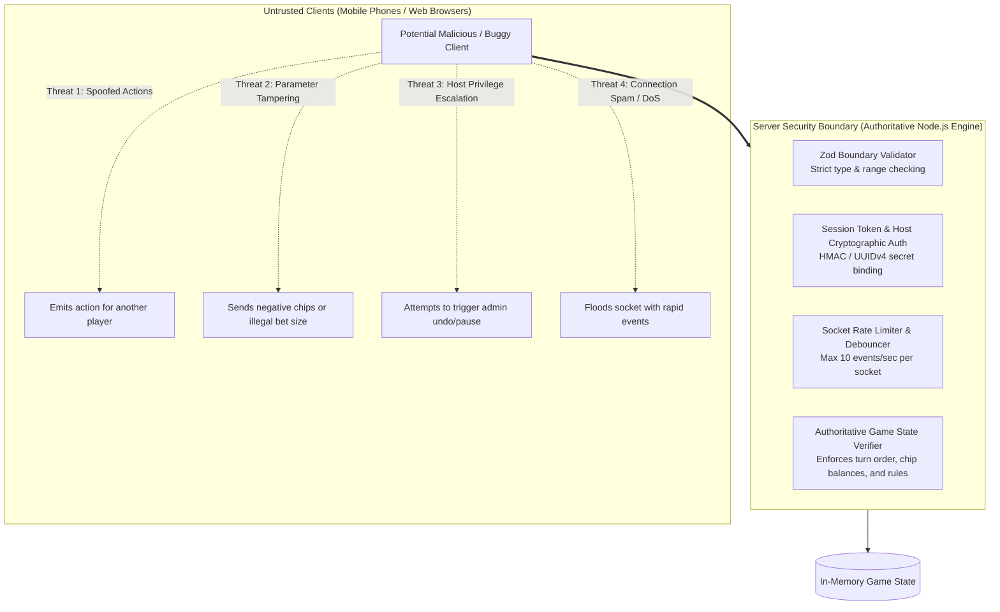
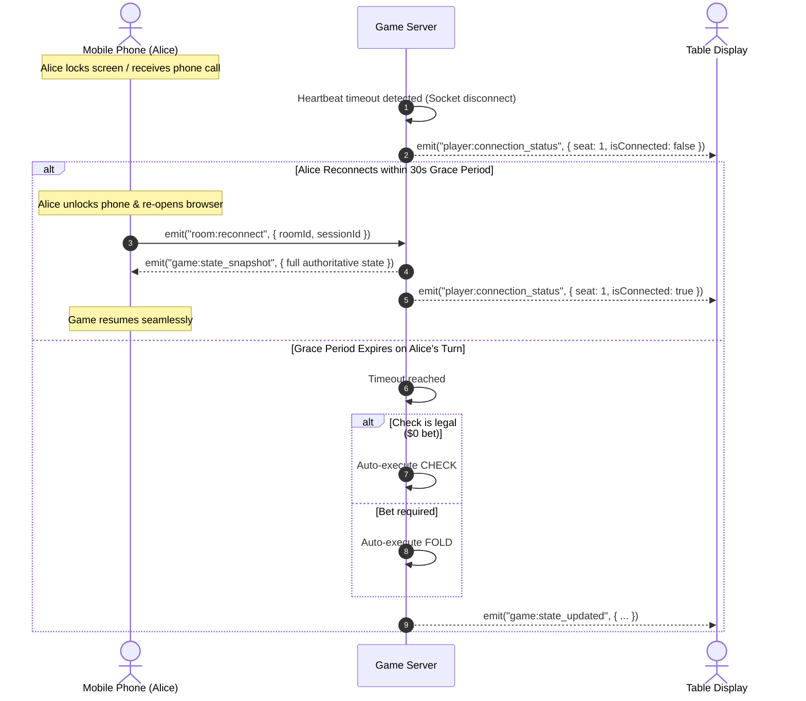
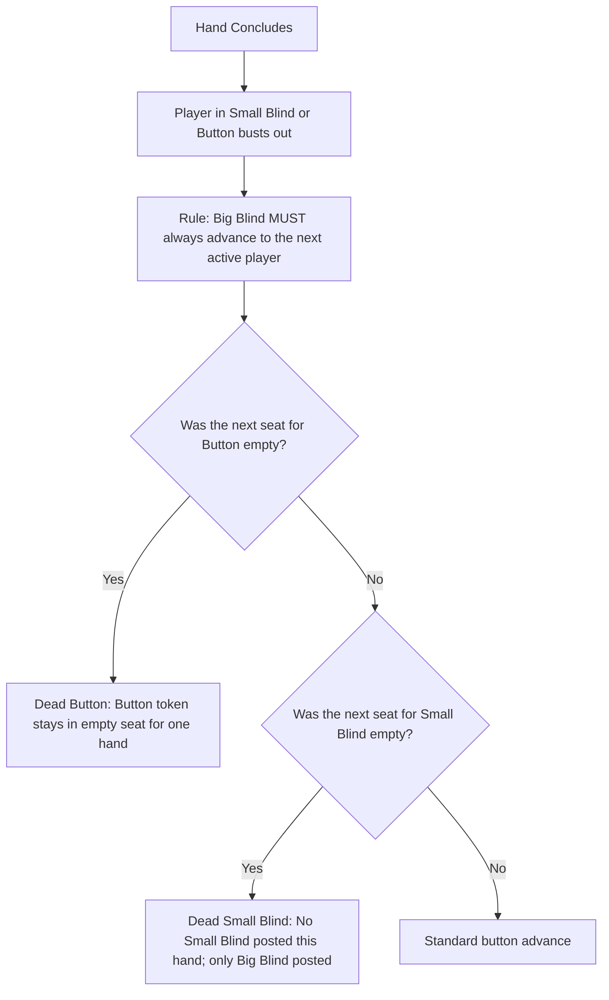
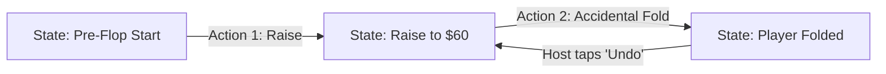

# Security & Edge Cases Specification: Poker Credits

## 1. Threat Model & Security Architecture

Even in home games, a digital companion app managing financial credits and pot distributions must be cryptographically sound, resilient to network disruption, and immune to client-side manipulation.



---

## 2. Core Security Controls

### 2.1. Authoritative Server Enforcement (Zero-Trust Client)
* **Clients are purely presentation displays**: The client never computes its own chip deductions or decides if a bet was successful.
* **Strict State Verification**:
  * The server checks:
    1. Is the incoming socket authenticated to the seat making the claim?
    2. Is it currently that seat's turn to act?
    3. Is the action legal on this street (e.g., cannot check if high bet > player's contribution)?
    4. Does the player have sufficient chips in their stack?
    5. Is the raise amount at least the required minimum raise?

### 2.2. Session Authentication & Impersonation Prevention
To prevent one player or spectator from spoofing actions for another player:
* Upon joining a room, the server issues a cryptographically secure random session token:
  ```typescript
  export interface PlayerSession {
    sessionId: string;      // UUIDv4 private token kept in client localStorage
    playerId: string;       // Public player ID
    roomId: string;
    seatIndex: number;
    isHost: boolean;
  }
  ```
* Every Socket.io packet must include this `sessionId` (or attach it during the initial socket handshake auth).
* Sockets can **only** dispatch actions for their assigned `playerId`. Any action referencing another player is rejected with a `403 FORBIDDEN` error.

### 2.3. Host Privilege Protection
* Administrative functions (e.g. `game:admin:undo`, `game:admin:pause`, `game:rebuy:approve`, `room:configure`) require a dedicated `hostToken`.
* The `hostToken` is generated when the central table display creates the room and is stored only in the host device's local memory.
* If a host disconnects, host status can only be reclaimed using this secret key.

### 2.4. Input Sanitization & XSS Prevention
* Player names, room codes, and avatar strings are validated against strict Zod rules:
  ```typescript
  export const PlayerNameSchema = z
    .string()
    .trim()
    .min(1, 'Name cannot be empty')
    .max(20, 'Name cannot exceed 20 characters')
    .regex(/^[a-zA-Z0-9 _-]+$/, 'Name contains invalid characters');
  ```
* All strings rendered in the Next.js UI are escaped by default to prevent Cross-Site Scripting (XSS).

### 2.5. Rate Limiting & Denial-of-Service (DoS) Mitigation
* **Socket Throttling**: Limits each socket to a maximum of 10 incoming events per second.
* **Action Idempotency**: Prevents rapid double-clicking (e.g. tapping "Raise" twice rapidly) using an `actionSequenceId` counter. If the sequence ID has already been executed for that street, duplicate requests are discarded.

---

## 3. Real-Time & Network Edge Cases



### 3.1. Mobile Screen Sleep & Backgrounding
* **Symptom**: Mobile Safari and Chrome pause JavaScript timers and suspend WebSockets when the phone screen turns off or the user switches tabs.
* **Resolution**:
  1. **Disconnection Grace Timer**: If it is the disconnected player's turn, a 30-second disconnect timer is started.
  2. **Auto-Action on Expiry**: If the player does not reconnect within the grace window:
     * If checking is free ($0), the server executes an **Auto-Check**.
     * If there is an outstanding bet to call, the server executes an **Auto-Fold**.
  3. **Instant Snapshot Sync**: When the player re-opens the tab, the socket reconnects with their `sessionId`, and the server sends a full state snapshot to reconcile the client.

### 3.2. Action Race Conditions (Concurrent Submissions)
* **Symptom**: Player A clicks "Check" at the exact millisecond Player B clicks "Raise".
* **Resolution**: 
  * The server processes incoming actions in a strict **FIFO serialized queue** per room.
  * If Player B's raise is processed first, Player A's "Check" action fails validation because checking is no longer legal.
  * The server responds with `INVALID_ACTION_ON_STREET` and sends the updated high bet ($X), prompting Player A to Call or Fold.

---

## 4. Poker Domain Edge Cases & Rules

### 4.1. The Dead Button & Missing Blinds Rule
When players bust out or leave the table, the blind positions can become distorted:



* **Core Invariant**: No player may ever be forced to pay the Big Blind twice in a row, nor may a player skip paying their Big Blind.
* **Dead Small Blind**: If the player due to pay the small blind just busted, only the Big Blind is posted.

### 4.2. Short All-In & The Betting Reopen Rule
In Texas Hold'em, an All-In bet that is smaller than the minimum legal raise is an **incomplete raise**:
* **Scenario**:
  * Big Blind is **$20**.
  * Player 1 bets **$100**.
  * Player 2 goes All-In for **$130** (an increase of only $30; minimum raise required was $100 + $80 = $180).
  * Player 3 Calls **$130**.
* **Rule**:
  * Because Player 2's raise was incomplete (< full raise), **betting is NOT reopened** for Player 1.
  * Player 1 may only **Call** the remaining $30 or **Fold**; Player 1 is **NOT allowed to re-raise**.
  * Betting would only reopen for Player 1 if Player 3 had made a full legal raise (e.g. to $210+).

### 4.3. Micro-Stack Sub-Blind All-Ins
* **Scenario**: Player has only **$6** remaining when it is their turn to post the **$20 Big Blind**.
* **Engine Handling**:
  * Player is automatically marked **All-In for $6**.
  * The Big Blind posted for the street is $20 (satisfied by the next largest contributor or treated as the benchmark).
  * The player with $6 is only eligible to win up to $6 from each opponent; the remaining $14 from each caller forms a separate pot tier.

### 4.4. Simultaneous Knockouts (Tournament Mode)
* If two or more players are eliminated in the exact same hand:
  * The player who entered the hand with **more chips** is awarded the higher finishing rank.
  * If they entered the hand with identical chip counts, they tie for the rank.

### 4.5. Dynamic Heads-Up Transition
* When a 3-handed table drops to 2 players:
  * The engine immediately detects `activePlayerCount === 2`.
  * Automatically switches to **Heads-Up rules**: Dealer Button posts the Small Blind and acts first pre-flop.

---

## 5. State Rollback & Undo Architecture (Host Misclick Recovery)

In home poker games, players frequently misclick (e.g. accidentally clicking "Fold" when they intended to "Call", or typing an extra 0 into a raise). 

To prevent ruining a hand, the engine implements an **Immutable State Stack**:



* **Snapshot History**: Before every action transition, a lightweight state snapshot is pushed onto the room's undo stack: `history: GameState[]`.
* **Undo Trigger**: When the host triggers `game:admin:undo`:
  1. The server pops the current state and restores the previous state snapshot.
  2. The restored state is immediately broadcast to all connected devices.
  3. Action ticker logs: *"Host reverted last action"*.
* **Limit**: The undo stack retains the last 5 actions within the active hand and resets when a new hand begins.

---

## 6. Additional Security Controls (Originally Missing)

> [!IMPORTANT]
> The following security controls were **absent from the original documentation** and are required before production deployment:

### 6.1. CORS Configuration
* The Socket.io and Fastify server must enforce an explicit `origin` allowlist.
* In cloud mode, only requests from the deployed Next.js domain (e.g. `https://pokercredits.app`) are accepted.
* In LAN mode, the origin is relaxed to `*` only within the local subnet—never for the publicly hosted instance.
```typescript
// server.ts
const io = new Server(httpServer, {
  cors: {
    origin: process.env.NODE_ENV === 'production'
      ? ['https://pokercredits.app']
      : '*',
    methods: ['GET', 'POST'],
  },
});
```

### 6.2. Room TTL & Server-Side Garbage Collection
* **Problem**: If all players disconnect without formally ending a game, the room's state object remains in server memory indefinitely, causing a memory leak in long-running servers.
* **Solution**: Each room has a `lastActivityAt` timestamp. A background interval runs every 5 minutes and purges any room that has had no activity for **60 minutes**.
* Upon purge, all connected sockets in that room are emitted a `room:expired` event so clients can show a graceful "Session Ended" screen.

### 6.3. Maximum Room Size Enforcement
* Hard limit of **10 players** per room, enforced at the `room:join` handler.
* Spectators (read-only, no seat) are counted separately and capped at **20 spectators** per room.

### 6.4. LAN Mode Security Considerations
> [!WARNING]
> In **LAN mode**, the server binds to `0.0.0.0` with no authentication on the network transport layer, because the assumption is that all devices on the local network are trusted participants. However:
> * Never expose the LAN server port to a public-facing network interface.
> * Clearly document to users that LAN mode should only be used on trusted private networks (home router, mobile hotspot) and not on public Wi-Fi (coffee shops, airports).
> * The same application-layer security controls (session tokens, Zod validation, turn verification) still apply in LAN mode.

### 6.5. Sensitive State Isolation (Player Hand Privacy)
* The `game:state_updated` broadcast sent to **all** room members must **never** include private player hole cards (in future card-input mode).
* Each player's private state (e.g. any future hole card input) must be sent only via a `game:private_state` event directed exclusively to that player's socket.
* The table host display receives only public information: chip counts, bets, actions, and pot totals.
