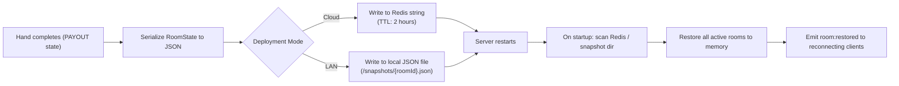

# Implementation Plan: Poker Credits Companion App

## Goal Description

Build **Poker Credits**, a real-time cross-platform companion app for physical Texas Hold'em poker games that replaces physical chips with a digital credit, pot, and betting management system.

- Physical cards are dealt by hand in real life.
- A central device (tablet, laptop, TV) placed at the table center serves as the **Table / Pot Display**.
- Each player connects on their own mobile device as a **Player Controller**.
- An optional **Spectator** role lets busted players or observers watch without a seat.
- The app orchestrates betting rounds, blinds rotation, turn order, chip deductions, min-raise validation, side pot calculations, and showdown payouts in real-time.
- Networking supports both **Cloud-hosted rooms** (4-letter room codes) and **Local Area Network (LAN/Offline)** play.

---

## Tech Stack (Finalised)

| Layer | Technology | Why |
| :--- | :--- | :--- |
| **Frontend Framework** | **Next.js 15 (App Router)** | File-based routing for `/table`, `/play`, `/watch`; SSR; API routes; PWA-ready |
| **UI Component System** | **shadcn/ui + Radix UI** | Accessible, pre-built `Slider`, `Dialog`, `Drawer`, `Badge`; works natively with Next.js |
| **Styling** | **Tailwind CSS** | Design tokens for poker felt theme; responsive radial layouts |
| **Animations** | **Framer Motion** | Chip fly animations, pot counter, active player glow halo |
| **Client State** | **Zustand** | Lightweight socket → UI synchronisation with optimistic updates |
| **Real-time Transport** | **Socket.io** | WebSocket with HTTP-polling fallback, room multiplexing, auto-reconnect |
| **Backend Framework** | **Node.js + Fastify** | High-concurrency, low-overhead HTTP + WebSocket server |
| **Shared Domain Engine** | **`@poker-credits/shared` (TypeScript)** | Pure poker logic shared between server and client — zero runtime deps |
| **Schema Validation** | **Zod** | Strict boundary validation on every socket payload and REST request |
| **Testing** | **Vitest + Playwright** | Unit (engine), integration (socket), and E2E (multi-tab) |
| **Monorepo** | **pnpm workspaces** | Shares TypeScript types and domain engine across packages |

---

## Project Structure (Complete & Expanded)

```
pocker-credits/
├── package.json                        # Root scripts: dev, build, test, lint
├── pnpm-workspace.yaml
├── .env.example                        # PORT, NODE_ENV, ALLOWED_ORIGINS, SNAPSHOT_DIR
├── tsconfig.base.json                  # Shared strict TypeScript config
├── .eslintrc.base.js                   # Shared ESLint config
├── docs/                               # All architecture & spec docs
│
├── packages/
│   │
│   ├── shared/                         # @poker-credits/shared
│   │   ├── src/
│   │   │   ├── types.ts                # Branded types, discriminated unions, enums
│   │   │   ├── constants.ts            # DEFAULT_BLINDS, MAX_PLAYERS, UNDO_STACK_LIMIT
│   │   │   ├── pokerEngine.ts          # State machine, turn order, street transitions
│   │   │   ├── potCalculator.ts        # Main pot & side pot tier calculations
│   │   │   ├── blindsStrategy.ts       # CashGame / Tournament blind strategies
│   │   │   ├── actionValidator.ts      # canCheck, canRaise, minRaiseTo, maxRaiseTo
│   │   │   ├── buttonRotation.ts       # Dead button, missing blinds, heads-up rules
│   │   │   └── index.ts
│   │   ├── test/
│   │   │   ├── pokerEngine.test.ts
│   │   │   ├── potCalculator.test.ts
│   │   │   ├── actionValidator.test.ts
│   │   │   ├── blindsStrategy.test.ts
│   │   │   └── buttonRotation.test.ts
│   │   ├── tsconfig.json
│   │   └── package.json
│   │
│   ├── server/                         # @poker-credits/server
│   │   ├── src/
│   │   │   ├── server.ts               # Fastify + Socket.io bootstrap
│   │   │   ├── config.ts               # ENV config, CORS, rate limits
│   │   │   ├── roomManager.ts          # Room CRUD, GC/TTL, snapshot save/restore
│   │   │   ├── gameSession.ts          # Active hand state, action queue (FIFO)
│   │   │   ├── actionQueue.ts          # ⬅ FIFO serialised queue (race condition fix)
│   │   │   ├── sessionStore.ts         # In-memory player session tokens
│   │   │   ├── snapshotStore.ts        # Post-hand JSON snapshot persistence
│   │   │   ├── lanDiscovery.ts         # Local IP binding + QR code URL builder
│   │   │   ├── routes/
│   │   │   │   ├── health.ts           # GET /health
│   │   │   │   ├── lanInfo.ts          # GET /api/lan/info
│   │   │   │   └── roomExists.ts       # GET /api/room/:roomId/exists
│   │   │   └── socket/
│   │   │       ├── roomHandlers.ts     # room:create, room:join, room:reconnect
│   │   │       ├── gameHandlers.ts     # game:start, game:action, game:admin:*
│   │   │       └── middleware.ts       # Auth middleware (session token validation)
│   │   ├── test/
│   │   │   ├── gameSession.test.ts     # Integration: multi-client socket hand sim
│   │   │   └── actionQueue.test.ts     # Race condition unit tests
│   │   ├── tsconfig.json
│   │   └── package.json
│   │
│   └── client/                         # @poker-credits/client (Next.js 15)
│       ├── app/
│       │   ├── page.tsx                # Landing / Join room / Create room
│       │   ├── table/
│       │   │   └── [roomId]/page.tsx   # TABLE_HOST view
│       │   ├── play/
│       │   │   └── [roomId]/page.tsx   # PLAYER view (mobile controller)
│       │   └── watch/
│       │       └── [roomId]/page.tsx   # SPECTATOR view (read-only)
│       ├── components/
│       │   ├── ui/                     # shadcn/ui primitives (auto-generated)
│       │   ├── table/
│       │   │   ├── FeltLayout.tsx      # Oval table with radial seats
│       │   │   ├── PotDisplay.tsx      # Animated main pot + side pots
│       │   │   ├── SeatRing.tsx        # All seats with D/SB/BB/turn badges
│       │   │   ├── ActionTicker.tsx    # Live action feed
│       │   │   └── ShowdownModal.tsx   # Winner selector (split pot support)
│       │   ├── player/
│       │   │   ├── ActionButtons.tsx   # Fold / Check / Call / Raise
│       │   │   ├── RaiseSlider.tsx     # shadcn Slider + quick fraction buttons
│       │   │   └── TurnAlert.tsx       # Full-screen "YOUR TURN" pulse + haptics
│       │   └── common/
│       │       ├── QRCodeDisplay.tsx   # Dynamic QR code for room join
│       │       ├── SoundEngine.tsx     # Web Audio API wrapper
│       │       └── WakeLockBanner.tsx  # Screen wake lock status indicator
│       ├── hooks/
│       │   ├── usePokerSocket.ts       # Socket.io connection + event subscriptions
│       │   ├── useGameStore.ts         # Zustand store slice for game state
│       │   ├── useWakeLock.ts          # Screen Wake Lock API
│       │   ├── useHaptics.ts           # Vibration API
│       │   └── useSound.ts             # Web Audio API sound triggers
│       ├── lib/
│       │   ├── socket.ts               # Socket.io client singleton
│       │   └── utils.ts                # cn(), formatChips(), potFraction()
│       ├── public/
│       │   ├── sounds/                 # chip-clink.mp3, check-knock.mp3, etc.
│       │   └── manifest.json           # PWA config
│       ├── next.config.ts
│       ├── tailwind.config.ts
│       ├── tsconfig.json
│       └── package.json
```

---

## Race Conditions: Analysis & Mitigations

> [!IMPORTANT]
> Real-time multiplayer games are highly susceptible to race conditions. Every known race condition in this system is listed below with its exact mitigation.

### RC-001: Concurrent Player Actions (Same Street, Simultaneous Submission)

**Scenario**: Player A clicks "Check" at the exact same millisecond Player B clicks "Raise". Both socket events arrive at the server within the same event loop tick.

**Root Cause**: Node.js is single-threaded but I/O events from multiple sockets can be queued and processed in rapid succession. Without serialisation, both actions could read the same game state before either is committed.

**Mitigation — Per-Room FIFO Action Queue (`actionQueue.ts`)**:
```
Socket Event Arrives
       |
       v
[Room Action Queue] -- FIFO, one action processed at a time
       |
       v
[Poker State Machine] -- reads current state, validates, returns new state
       |
       v
[State is atomically replaced in memory]
       |
       v
[Broadcast new state to all room sockets]
```
- The queue is a simple `Promise` chain per room: `queue = queue.then(() => processAction(action))`.
- If Player A's "Check" is processed first, Player B's "Raise" runs next and succeeds normally.
- If Player B's "Raise" is processed first, Player A's "Check" fails validation (`INVALID_CHECK`) and the server sends the updated `callAmount` back to Player A only.

---

### RC-002: Reconnect vs. Action Mid-Disconnect

**Scenario**: Player goes offline while an action is in-flight. The server processes the action, but the player reconnects and tries to send the same action again (browser retry / double-tap before reconnect resolved).

**Mitigation — `actionSequenceId` Idempotency Key**:
- Every player action carries a monotonically incrementing `actionSequenceId` (0-based per hand, per player).
- The server stores `lastProcessedSequenceId` per player per room.
- If an incoming `actionSequenceId <= lastProcessedSequenceId`, the action is silently discarded.
- On reconnect, `game:state_snapshot` delivers the current state; the client resets its `actionSequenceId` counter from the snapshot.

---

### RC-003: Turn Timer Expiry vs. Late-Arriving Action

**Scenario**: Player submits a valid action at T=29.9s on a 30-second timer. The server processes the timer expiry at T=30s and auto-folds the player — but the player's real action arrives at T=30.001s (in the queue after the timer).

**Mitigation — Timer Cancellation Before Queue Flush**:
- The per-player turn timer is a `NodeJS.Timeout` handle stored in `GameSession`.
- Before dequeuing a player's action, the server immediately calls `clearTimeout(playerTimerHandle)`.
- If the timeout already fired, `clearTimeout` is a no-op and the auto-fold is the committed action.
- If `clearTimeout` succeeds, the real player action is processed and the timeout is treated as cancelled.
- This is safe because both paths (timeout fire and action arrival) go through the same serialised action queue.

---

### RC-004: Double "Start Hand" (Host Taps Button Twice Quickly)

**Scenario**: Table host double-taps "Deal Hand". Two `game:start` events fire. The second one attempts to start a new hand while the first is mid-transition.

**Mitigation**:
- `GameSession` tracks a boolean `isTransitioning: boolean` flag.
- Any `game:start` or street-advance event sets `isTransitioning = true` at the start, and clears it once the state broadcast completes.
- Any subsequent `game:start` received while `isTransitioning === true` is immediately rejected with `HAND_NOT_IN_PROGRESS`.

---

### RC-005: Rebuy Approval During Active Hand

**Scenario**: A busted player requests a rebuy just as the host clicks "Deal Hand". The rebuy approval arrives while chips are being allocated for the new hand.

**Mitigation**:
- Rebuys are **only applied at `NEXT_HAND_PREP` state**. If the game has already moved to `STARTING_HAND` or later, the rebuy is queued as a `pendingRebuy` and applied at the start of the *following* hand.
- This ensures no chip balance is mutated mid-hand.

---

## State Storage & Database Strategy

### Primary Store: In-Memory JavaScript `Map`

```
roomId (string)  →  RoomState (object)
                     ├── config: RoomConfig
                     ├── players: Map<PlayerId, PlayerState>
                     ├── gameState: GameState
                     ├── history: GameState[]        (undo stack, last 5)
                     ├── actionQueue: Promise<void>  (RC-001 fix)
                     ├── lastActivityAt: Date
                     └── snapshots: HandSummary[]    (completed hands log)
```

- **Zero I/O latency**: All game state reads/writes are in-process memory operations (<1ms).
- **No database infrastructure needed** for casual home game deployment.

### Crash Recovery: Post-Hand JSON Snapshots



**What is NOT snapshotted (only committed at hand end)**:
- The undo history stack (irrelevant after hand ends).
- The per-player action timer handle (timers restart on restore).

**What IS snapshotted**:
- All player chip balances.
- Dealer button position.
- Hand number.
- Blind level (tournament mode).

---

## Design Patterns Applied

### 1. Repository Pattern (State Access Layer)

All reads and writes to the in-memory room state go through a `RoomRepository` class rather than directly accessing the `Map`. This makes swapping the storage backend (e.g. to Redis) a single-file change:

```typescript
interface IRoomRepository {
  findById(roomId: RoomId): RoomState | undefined;
  save(room: RoomState): void;
  delete(roomId: RoomId): void;
  all(): RoomState[];
}

class InMemoryRoomRepository implements IRoomRepository { /* ... */ }
class RedisRoomRepository implements IRoomRepository { /* ... */ }
```

### 2. Command Pattern (Player Actions as Commands)

Each player action is modelled as a typed Command object. The `GameSession` receives a command, validates it, and executes it against the current state. This makes undo (by storing previous state) and audit logging (by storing the command log) trivial.

```typescript
interface Command {
  type: PlayerActionType;
  playerId: PlayerId;
  actionSequenceId: number;
  issuedAt: Date;
}

interface CommandResult {
  nextState: GameState;
  events: GameEvent[];  // Events to broadcast (e.g. ActionPerformed, TurnAdvanced)
}

type CommandHandler = (state: GameState, cmd: Command) => Result<CommandResult, PokerError>;
```

### 3. Strategy Pattern (Blind Structures)

```typescript
interface BlindsStrategy {
  getBlinds(handNumber: number, elapsedMs: number): { smallBlind: number; bigBlind: number; ante: number };
  getLabel(): string; // "Level 3 – $50/$100 (Ante: $25)"
}

class CashGameBlinds implements BlindsStrategy { /* fixed */ }
class TournamentBlinds implements BlindsStrategy { /* timed levels */ }
```

### 4. Observer Pattern (Socket Event Bus)

The `GameSession` does not know about Socket.io. It emits typed domain events (e.g. `TurnAdvancedEvent`, `StreetChangedEvent`) via an internal `EventEmitter`. The socket layer subscribes to these events and translates them into Socket.io broadcasts. This keeps game logic cleanly decoupled from transport.

```typescript
// game layer (pure)
session.on('TurnAdvanced', (event) => { /* ... */ });

// socket layer (transport)
gameSession.on('TurnAdvanced', ({ activeSeat, timeLimit }) => {
  io.to(room).emit('game:state_updated', buildStateBroadcast(gameState));
  io.to(playerSocket).emit('game:turn_prompt', buildTurnPrompt(gameState));
});
```

### 5. State Machine Pattern (Game Progression)

The Texas Hold'em hand lifecycle is implemented as an explicit finite-state machine — not as ad-hoc `if/else` chains. Every state has a defined set of valid transitions. Any attempt to transition to an invalid next state throws a `INVALID_TRANSITION` error rather than silently corrupting state.

```typescript
const VALID_TRANSITIONS: Record<GameStreet, GameStreet[]> = {
  LOBBY:              ['STARTING_HAND'],
  STARTING_HAND:      ['POSTING_BLINDS'],
  POSTING_BLINDS:     ['PRE_FLOP'],
  PRE_FLOP:           ['FLOP', 'ALL_IN_RUNOUT', 'HAND_WON_UNCONTESTED', 'PAUSED'],
  FLOP:               ['TURN', 'ALL_IN_RUNOUT', 'HAND_WON_UNCONTESTED', 'PAUSED'],
  TURN:               ['RIVER', 'ALL_IN_RUNOUT', 'HAND_WON_UNCONTESTED', 'PAUSED'],
  RIVER:              ['SHOWDOWN', 'HAND_WON_UNCONTESTED', 'PAUSED'],
  ALL_IN_RUNOUT:      ['SHOWDOWN'],
  SHOWDOWN:           ['PAYOUT'],
  HAND_WON_UNCONTESTED: ['PAYOUT'],
  PAUSED:             ['PRE_FLOP', 'FLOP', 'TURN', 'RIVER'],
  PAYOUT:             ['NEXT_HAND_PREP'],
  NEXT_HAND_PREP:     ['STARTING_HAND', 'LOBBY'],
};
```

### 6. Pure Reducer Pattern (Immutable State Transitions)

Every game state transition is a pure function. The old state is never mutated:

```typescript
type GameReducer = (state: Readonly<GameState>, action: PlayerAction) => Result<GameState, PokerError>;

// Usage in GameSession:
const result = pokerReducer(currentState, action);
if (!result.success) return sendError(socket, result.error);

// Only replace state after successful validation:
this.state = result.data;
this.history.push(currentState); // push OLD state for undo
```

### 7. Factory Pattern (Room & Session Creation)

Room codes and session tokens are never created ad-hoc inline. Dedicated factories ensure consistent formatting and cryptographic strength:

```typescript
class RoomCodeFactory {
  static generate(): RoomId {
    // Generates 4 uppercase alphanumeric chars, excluding ambiguous chars (0/O, 1/l/I)
    const chars = 'ABCDEFGHJKLMNPQRSTUVWXYZ23456789';
    return Array.from({ length: 4 }, () => chars[crypto.randomInt(chars.length)]).join('') as RoomId;
  }
}

class SessionTokenFactory {
  static generate(): string {
    return crypto.randomUUID(); // UUIDv4, cryptographically secure
  }
}
```

---

## Phased Implementation Plan (Revised & Expanded)

### Phase 0: Monorepo Bootstrap (Day 1)
- Initialise `pnpm` workspace with root `package.json` and `pnpm-workspace.yaml`.
- Configure shared `tsconfig.base.json` (strict mode, path aliases).
- Setup shared ESLint + Prettier + Husky pre-commit hooks.
- Create all three package skeletons (`shared`, `server`, `client`) with proper `package.json` workspace references.

### Phase 1: Shared Core Poker Engine (`@poker-credits/shared`)
- Define all branded types, discriminated unions, and enums in `types.ts`.
- Implement `buttonRotation.ts`: Dead button rule, missing blinds, dynamic heads-up detection.
- Implement `actionValidator.ts`: `canCheck`, `canCall`, `canRaise`, `minRaiseTo`, `maxRaiseTo`, short all-in detection.
- Implement `potCalculator.ts`: Contribution-tier side pot algorithm, uncalled bet refund, odd-chip split.
- Implement `blindsStrategy.ts`: `CashGameBlinds` and `TournamentBlinds` strategy classes.
- Implement `pokerEngine.ts`: Pure reducer, state machine with `VALID_TRANSITIONS` guard.
- **Write full unit test suite (target: 100% branch coverage)**:
  - 3-way all-in side pot scenario.
  - Heads-up SB/BB reversal.
  - Short all-in non-reopen rule.
  - Dead button with bust-out.
  - Incomplete raise not reopening betting.
  - Odd-chip distribution (earliest clockwise seat).
  - Auto-check and auto-fold on timeout.

### Phase 2: Authoritative Server (`@poker-credits/server`)
- Bootstrap Fastify with CORS, rate-limit plugin, and health route.
- Implement `InMemoryRoomRepository` with Room TTL garbage collector (60-min expiry).
- Implement `SnapshotStore`: post-hand JSON write (file-based for LAN, Redis-string compatible for cloud).
- Implement `SessionStore`: session token issuance, lookup, and expiry.
- Implement `ActionQueue`: per-room FIFO `Promise` chain (RC-001 fix).
- Implement `GameSession`:
  - Command handler registry (Fold, Check, Call, Raise, All-In, AdminUndo, AdminPause).
  - Turn timer with `clearTimeout` guard (RC-003 fix).
  - `isTransitioning` guard (RC-004 fix).
  - Pending rebuy queue (RC-005 fix).
  - Undo stack (last 5 states per hand).
- Implement all Socket.io event handlers with `middleware.ts` session token auth.
- Implement `lanDiscovery.ts`: `os.networkInterfaces()` + QR code URL builder.
- **Write integration tests**: 4 simulated socket clients, full hand, reconnect, undo, all-in scenario.

### Phase 3: Client — Table / Pot Display Screen
- Scaffold Next.js 15 with Tailwind CSS, shadcn/ui, and Framer Motion.
- Implement `usePokerSocket` hook (socket connect, disconnect, event subscriptions, reconnect).
- Implement `useGameStore` (Zustand): full `GameStateBroadcast` stored reactively.
- Build `FeltLayout` with CSS `sin()`/`cos()` radial seat positioning.
- Build `PotDisplay` with animated chip counter using Framer Motion `useSpring`.
- Build `SeatRing` with D / SB / BB badges, active turn glow, and fold/all-in overlays.
- Build `ActionTicker` real-time feed.
- Build `ShowdownModal` with per-pot eligible player chips and split pot toggle.
- Build `QRCodeDisplay` using `qrcode` or `react-qr-code` library.
- Screen Wake Lock integration (`useWakeLock` hook).
- Web Audio sound effects (`useSound` hook).

### Phase 4: Client — Player Mobile Controller Screen
- Build `TurnAlert` full-screen pulse with haptic trigger (`useHaptics`).
- Build `ActionButtons` context-aware (fold, check vs call, bet/raise).
- Build `RaiseSlider`: shadcn `Slider`, quick fraction buttons (`Min`, `½ Pot`, `¾ Pot`, `Pot`, `All-In`), manual keypad input.
- Optimistic UI: tentatively show bet committed on player's device before server confirms.
- Rebuy / add-on request modal via shadcn `Drawer`.

### Phase 5: Spectator View + Polish
- Implement `/watch/[roomId]` read-only view receiving `game:state_updated` without any action controls.
- Tournament blind clock UI component for table display.
- Full responsive design audit (6.1" portrait phone → 12.9" landscape iPad → 65" TV).
- PWA manifest + service worker for "Add to Home Screen".
- LAN mode offline documentation and `npx poker-credits` CLI launcher.

### Phase 6: End-to-End Testing & Deployment
- Playwright E2E: 4 browser tabs simulate a full game (join, bet, all-in, showdown, rebuy).
- Load test: 10 concurrent rooms, 10 players each.
- Cloud deployment: Fly.io / Render Dockerfile.
- Environment variable documentation.

---

## Verification Plan

### Automated Test Commands
```bash
# Unit tests (shared engine)
pnpm --filter @poker-credits/shared test

# Integration tests (server with socket clients)
pnpm --filter @poker-credits/server test

# E2E tests (full browser flows)
pnpm --filter @poker-credits/client test:e2e

# Full suite
pnpm test
```

### Race Condition Verification Checklist
- [ ] **RC-001**: Submit two actions within the same 5ms window via test harness; verify only one succeeds and the other returns a clear error.
- [ ] **RC-002**: Submit the same `actionSequenceId` twice; verify second is silently discarded and state is unchanged.
- [ ] **RC-003**: Submit action at T=29.9s in a 30s timer; verify action is processed (not auto-folded) even if timer fires at T=30.0s.
- [ ] **RC-004**: Emit `game:start` twice within 10ms; verify only one hand starts.
- [ ] **RC-005**: Approve rebuy at the exact moment a new hand starts; verify chips are applied to the *next* hand, not the mid-transition current hand.

### Manual Verification Checklist
1. Open 1 browser tab as Table Host (laptop).
2. Open 4 mobile browsers (or phone-sized Chrome DevTools) as Players by scanning QR code.
3. Verify SB and BB auto-deducted. Verify UTG highlighted.
4. Execute Raise → Call → Fold sequence. Verify all devices update within 100ms.
5. Go all-in with 3 unequal stacks. Verify side pots appear on table screen.
6. Lock phone screen during your turn. Verify 30s grace timer shows on table. Verify auto-fold after 30s.
7. Unlock phone and reconnect. Verify state snapshot restores instantly.
8. Host taps Undo. Verify last action reverted across all devices.
9. Kill and restart server. Verify room restores from JSON snapshot.
10. Test in LAN mode (kill internet). Verify QR code works via local IP.
